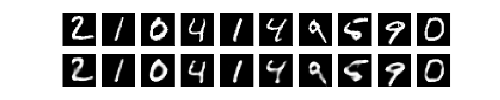

# Autoencoders-Implementation
This repository contains the implementation and visualisation of some autoencodrs for latent space pattern-learning

### **Convolutional Autoencoder**

Trained a three layered convolution encoder and corresponding decoder on MNIST dataset for **50 EPOCHS** and reduced the latent image representation to 49 neurons and still got good results.

A brief Summary of it -
 - Trained for - 50 epochs
 - train:val:test dataset ratio = 8:4:3
 - train_loss = 0.0877
 - val_loss = 0.0875
 - test_loss = 0.0866
 - lr = 0.001
 - batch_size = 64
 - optimizers = Adam
 - loss = BinaryCrossEntropy

Some visualisations of both original and reconstructed images at different instances

Epoch -1 ( <b>Original</b> above, <b>Reconstructed</b> below) 
  
Epoch -11 
  
Epoch -21 
  
Epoch -31 
  
Epoch -41 
   
Epoch -50 
  

It's good that with the latent feature represenation of 49 dimensions we able to generate good reconstructed images

